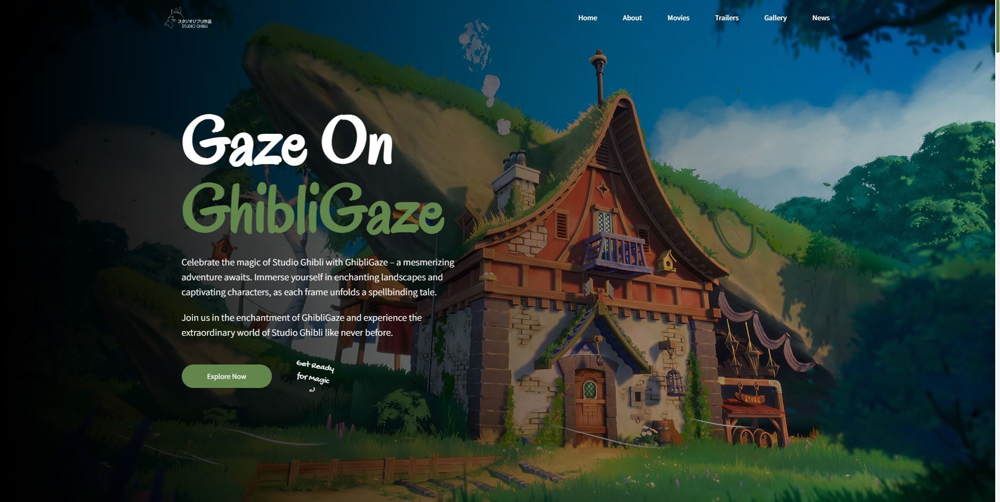

# GhibliGaze

## Overview

GhibliGaze is a landing page project dedicated to celebrating the extraordinary creations of Studio Ghibli. The page showcases information about Ghibli's iconic movies, captivating trailers, a visually stunning gallery, and the latest news from the Ghibli universe.



## Technologies Used

- **React (JSX)**
- **Tailwind CSS**
- **YouTube API**

## Getting Started

1. **Clone the Repository:**

   ```bash
   git clone https://github.com/s-shemmee/GhibliGaze.git
   ```

2. **Navigate to the Project Directory:**

   ```bash
   cd GhibliGaze
   ```

3. **Install Dependencies:**

   ```bash
   npm install
   ```

4. **Start the Development Server:**
   ```bash
   npm run dev
   ```
   > This will start the development server, and you can view the landing page at http://localhost:3000 in your browser.

## Demo

A live demo of GhibliGaze is available at [LIVE DEMO](https://ghibli-gaze.vercel.app). Explore the magic of Studio Ghibli at your fingertips!

## Credits

- The anime posters in the Movies section were found and used from the Behance project _Posters : Studio Ghibli_ of [Joseph K. Roman](https://www.behance.net/josephroman).

## License

This project is licensed under the MIT License.
