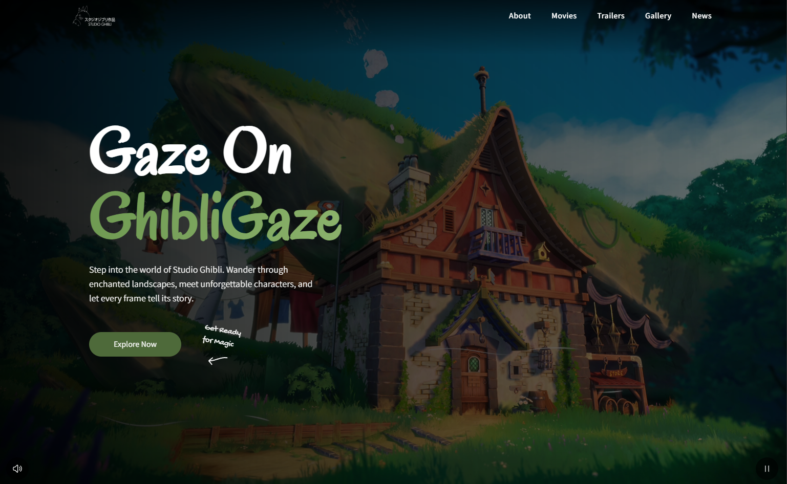

# GhibliGaze

## Overview

GhibliGaze is a fan-made site celebrating the work of Studio Ghibli. It showcases the studio's iconic movies, trailers, a gallery, and Ghibli-related news, along with a newsletter for updates. GhibliGaze is an independent project, not affiliated with or endorsed by Studio Ghibli.



## Technologies Used

- **React (JSX)** + **React Router**
- **Tailwind CSS**
- **YouTube Data API v3** (trailers, fetched at build time)
- **Buttondown** (newsletter subscriptions)

## Getting Started

1. **Clone the Repository:**

   ```bash
   git clone https://github.com/s-shemmee/GhibliGaze.git
   ```

2. **Navigate to the Project Directory:**

   ```bash
   cd GhibliGaze
   ```

3. **Install Dependencies:**

   ```bash
   npm install
   ```

4. **Set Up the YouTube Data API Key (optional, for refreshing trailers):**

   Trailer data lives in `src/data/trailers.json` and is generated by `scripts/fetch-trailers.mjs`, a build-time script — the API key is never bundled into the site or exposed to visitors. You only need it if you want to regenerate that file yourself.

   - Get a YouTube Data API v3 key from the [Google Developers Console](https://console.developers.google.com/).
   - Create a `.env` file in the project root:

     ```plaintext
     YOUTUBE_API_KEY=YOUR_YOUTUBE_DATA_API_KEY
     ```

   - Run the script:

     ```bash
     node scripts/fetch-trailers.mjs
     ```

5. **Set Up the Newsletter (optional):**

   The newsletter form in `src/components/Newsletter.jsx` posts directly to Buttondown's public embed endpoint — no API key or `.env` needed. Just set your username:

   ```js
   const BUTTONDOWN_USERNAME = "your-username-here";
   ```

6. **Start the Development Server:**

   ```bash
   npm run dev
   ```

   > Visit `http://localhost:5173` in your browser.

## Demo

A live demo of GhibliGaze is available at [LIVE DEMO](https://ghibli-gaze.vercel.app). Explore the magic of Studio Ghibli at your fingertips!

## Credits

- The anime posters in the Movies section are from the Behance project [_Posters: Studio Ghibli_](https://www.behance.net/gallery/96845285/Posters-Studio-Ghibli) by [Joseph K. Roman](https://www.behance.net/josephroman).
- The hero background video is by [Jasmin Habezai-Fekri](https://www.artstation.com/curlscurly) on ArtStation.
- Full credits are also listed on the site's [Privacy Policy & Credits](https://ghibli-gaze.vercel.app/privacy-policy) page.

## License

This project is licensed under the MIT License.
